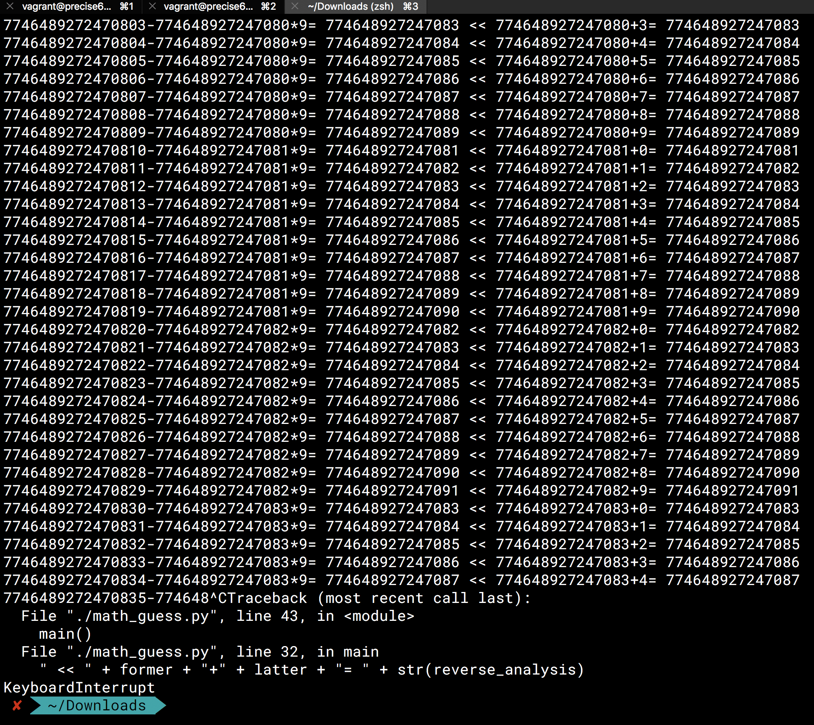

# math_guess
An interesting math law i found

# Test tool how-to
```
usage: math_guess.py [-h] -i INITIALNUM

A tool to compute an interesting math guess

optional arguments:
  -h, --help            show this help message and exit
  -i INITIALNUM, --initialNum INITIALNUM
                        The number(>=10) u wanna computer at the beginning
```

# Background
I discoveried this math law since i was in primary school, as for which grade i remembered it was around second or third. But at that moment, i just manully calculate this within the number 20. Then when i was in senir high school, i remembered it was manully calculated to the number 1000 or so. Now i use the computer program to help me automatically compute this math guess.

# Description

At first, i show u two screenshots as below.  




# Guess
I believe u already have a good understanding about what math law it is via the above two screenshots.
And coz i have found whatever how much huge the integer i specify as the initial computing number, such math law can still apply on that number. So now i propose such below math guess:  
For any integer which is equal or larger than the number 10 can all apply on the above math law.
